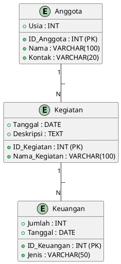
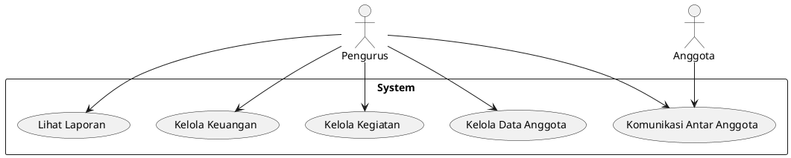
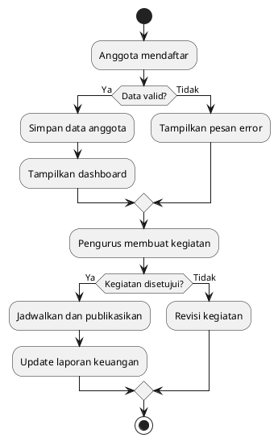

# *Laporan Analisis Sistem Manajemen Karang Taruna*

## *1. Latar Belakang*

Karang Taruna merupakan organisasi kepemudaan yang berperan penting dalam pemberdayaan masyarakat melalui berbagai kegiatan sosial dan komunitas. Dalam mengelola keanggotaan serta merancang berbagai kegiatan, sering kali Karang Taruna menghadapi kendala dalam pencatatan data anggota, perencanaan program, serta dokumentasi hasil kegiatan.

Saat ini, banyak Karang Taruna yang masih menggunakan metode manual dalam pengelolaan organisasi, sehingga rawan terjadi kehilangan data, kurangnya transparansi dalam pelaporan, serta kesulitan dalam koordinasi antar anggota. Oleh karena itu, pengembangan sistem berbasis teknologi menjadi solusi yang efektif untuk meningkatkan efisiensi dan transparansi dalam pengelolaan Karang Taruna.

## *2. Identifikasi Masalah*

Beberapa permasalahan utama yang dihadapi dalam pengelolaan Karang Taruna adalah:

1. Kesulitan dalam pencatatan dan manajemen data anggota.
2. Kurangnya sistem yang sistematis dalam perencanaan dan evaluasi kegiatan.
3. Minimnya transparansi dalam laporan keuangan dan pelaksanaan program.
4. Kesulitan dalam mengatur jadwal kegiatan dan berkoordinasi antar anggota.
5. Kurangnya dokumentasi digital terkait program yang telah dilaksanakan.

## *3. Rumusan Masalah*

1. Bagaimana membangun sistem manajemen berbasis teknologi yang mencakup data anggota, perencanaan program, dan evaluasi kegiatan?
2. Bagaimana sistem ini dapat membantu dalam penjadwalan dan koordinasi kegiatan secara efektif?
3. Bagaimana sistem ini dapat menyediakan laporan transparan mengenai keuangan dan dokumentasi kegiatan?
4. Bagaimana sistem ini dapat mempermudah komunikasi dan interaksi antar anggota?

## *4. Tujuan Penelitian*

1. Mengembangkan sistem manajemen keanggotaan yang terstruktur dan mudah diakses.
2. Membangun fitur untuk perencanaan, pelaksanaan, dan evaluasi kegiatan Karang Taruna.
3. Mengembangkan sistem laporan keuangan yang transparan dan mudah diaudit.
4. Membuat fitur untuk penjadwalan dan pengorganisasian kegiatan agar lebih efisien.
5. Menyediakan sistem komunikasi internal untuk memperkuat koordinasi antar anggota.

## *5. Metode Analisis*

### *5.1. What (Apa)*
- Sistem ini bertujuan untuk meningkatkan efektivitas pengelolaan Karang Taruna dengan pendekatan berbasis teknologi.
- Masalah utama yang ingin diselesaikan adalah kesulitan dalam pencatatan anggota, koordinasi, serta dokumentasi kegiatan.

### *5.2. Why (Mengapa)*
- Sistem ini diperlukan untuk meningkatkan efisiensi organisasi dan mendorong transparansi dalam pengelolaan Karang Taruna.
- Laravel dipilih karena fleksibilitasnya dalam pengembangan web, Docker untuk memastikan lingkungan pengembangan konsisten, dan MySQL untuk penyimpanan data terstruktur.

### *5.3. Who (Siapa)*
- Sistem ini melibatkan anggota Karang Taruna, ketua, bendahara, dan pengurus lainnya.
- Pengguna utama adalah pengurus untuk mengelola keanggotaan dan kegiatan.

### *5.4. When (Kapan)*
- Implementasi sistem direncanakan dalam waktu enam bulan setelah tahap pengembangan dan pengujian.
- Evaluasi sistem dilakukan setiap enam bulan untuk penyesuaian fitur dan kebutuhan organisasi.

### *5.5. Where (Di Mana)*
- Sistem ini akan digunakan di setiap unit Karang Taruna dan dapat diakses melalui web dashboard.
- Data disimpan dalam database MySQL yang dapat dihosting secara lokal atau di cloud.

### *5.6. How (Bagaimana)*
- Sistem dikembangkan menggunakan Laravel untuk backend dan frontend, Docker untuk containerisasi, serta MySQL untuk penyimpanan data.
- Anggota mendaftar, data mereka disimpan, pengurus melakukan evaluasi kegiatan, dan sistem menyediakan laporan otomatis.

## *6. Perancangan Sistem*

### *6.1. Entity Relationship Diagram (ERD)*



### *6.2. Use Case Diagram*



### *6.3. Flowchart*



### *6.4. Implementasi Database (SQL)*

```sql
CREATE TABLE Anggota (
    ID_Anggota INT PRIMARY KEY AUTO_INCREMENT,
    Nama VARCHAR(100),
    Usia INT,
    Kontak VARCHAR(20)
);

CREATE TABLE Kegiatan (
    ID_Kegiatan INT PRIMARY KEY AUTO_INCREMENT,
    Nama_Kegiatan VARCHAR(100),
    Tanggal DATE,
    Deskripsi TEXT
);

CREATE TABLE Keuangan (
    ID_Keuangan INT PRIMARY KEY AUTO_INCREMENT,
    Jenis VARCHAR(50),
    Jumlah INT,
    Tanggal DATE
);
```

### *6.5. Konfigurasi Docker untuk Laravel dan MySQL:*

```yaml
version: '3.8'
services:
  app:
    build: .
    container_name: laravel_app
    volumes:
      - .:/var/www/html
    depends_on:
      - db
  db:
    image: mysql:8
    container_name: mysql_db
    restart: always
    environment:
      MYSQL_ROOT_PASSWORD: root
      MYSQL_DATABASE: karang_taruna
      MYSQL_USER: user
      MYSQL_PASSWORD: password
    ports:
      - "3306:3306"
```

## *7. Kesimpulan*

Sistem manajemen Karang Taruna berbasis Laravel, Docker, dan MySQL ini bertujuan untuk meningkatkan efektivitas pengelolaan organisasi melalui pencatatan anggota, evaluasi kegiatan, serta transparansi dalam laporan keuangan dan koordinasi antar anggota.

