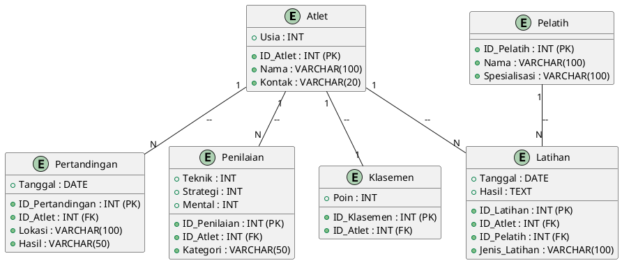
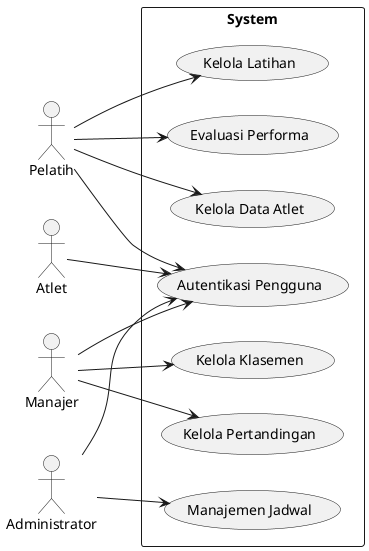
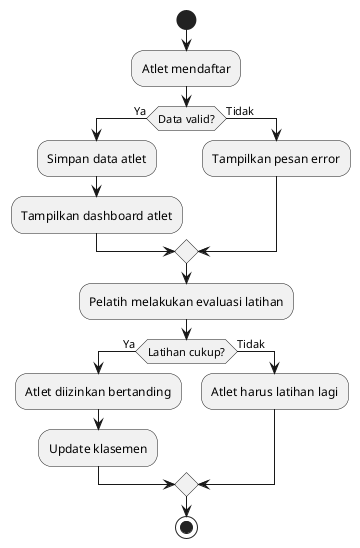

# *Laporan Analisis Sistem Manajemen Atlet Biliar*

## *1. Latar Belakang*

Olahraga billiard semakin berkembang di Indonesia, terbukti dengan prestasi atlet nasional di berbagai kompetisi. Untuk menjaga regenerasi atlet yang berkualitas, dibutuhkan sistem yang terstruktur guna mencari dan membina bakat muda secara berkelanjutan.

Namun, saat ini belum ada sistem digital yang mampu mendukung proses pembinaan secara efektif. Sistem manajemen yang baik diperlukan untuk mencatat data atlet, mengelola latihan, mengevaluasi performa, serta mengatur jadwal pertandingan dengan lebih efisien. Oleh karena itu, pengembangan sistem manajemen atlet berbasis teknologi menjadi solusi yang relevan dalam era digital ini.

## *2. Identifikasi Masalah*

Beberapa permasalahan utama yang dihadapi dalam pembinaan atlet billiard adalah:

1. Kurangnya sistem yang sistematis dalam pencarian dan pembinaan atlet berbakat.
2. Kesulitan dalam mengelompokkan atlet berdasarkan performa dan kesiapan bertanding.
3. Pemantauan dan evaluasi performa atlet belum memanfaatkan teknologi secara optimal.
4. Jadwal latihan dan pertandingan belum terorganisir dengan baik.
5. Kurangnya transparansi dalam klasifikasi dan penilaian atlet.

## *3. Rumusan Masalah*

1. Bagaimana membangun sistem manajemen berbasis teknologi yang mencakup company profile, kontrol dashboard, dan data atlet?
2. Bagaimana merancang porsi latihan yang efektif serta sistem penilaian yang transparan?
3. Bagaimana sistem ini dapat mengelompokkan atlet berdasarkan performa untuk menentukan kesiapan bertanding?
4. Bagaimana mengelola data klasemen agar atlet hanya bisa bertanding setelah menyelesaikan porsi latihan?
5. Bagaimana menyusun sistem manajemen waktu yang optimal untuk latihan dan pertandingan?

## *4. Tujuan Penelitian*

1. Mengembangkan sistem company profile yang memberikan gambaran lengkap tentang pusat pelatihan atlet billiard.
2. Merancang dashboard untuk manajemen pelatihan dan evaluasi atlet.
3. Menentukan porsi latihan yang optimal guna meningkatkan performa atlet.
4. Membangun sistem klasifikasi atlet berbasis performa untuk penentuan kesiapan bertanding.
5. Menyusun klasemen berdasarkan hasil latihan dan performa dalam pertandingan.
6. Merancang sistem manajemen jadwal pertandingan agar lebih efisien.

## *5. Metode Analisis*

### *5.1. What (Apa)*
- Sistem ini bertujuan untuk meningkatkan efektivitas pembinaan atlet billiard dengan pendekatan berbasis teknologi.
- Masalah utama yang ingin diselesaikan adalah kurangnya sistem pembinaan yang sistematis dan evaluasi performa yang belum optimal.

### *5.2. Why (Mengapa)*
- Sistem ini diperlukan untuk meningkatkan kualitas atlet billiard dan mendukung regenerasi atlet yang lebih terstruktur.
- Laravel dipilih karena fleksibilitasnya dalam pengembangan web, Docker untuk memastikan lingkungan pengembangan konsisten, dan MySQL untuk penyimpanan data terstruktur.

### *5.3. Who (Siapa)*
- Sistem ini melibatkan atlet, pelatih, manajer, dan administrator.
- Pengguna utama adalah pelatih dan manajer untuk memantau serta mengelola atlet.

### *5.4. When (Kapan)*
- Implementasi sistem direncanakan dalam waktu enam bulan setelah tahap pengembangan dan pengujian.
- Evaluasi performa atlet dilakukan setiap bulan dan setelah setiap pertandingan.

### *5.5. Where (Di Mana)*
- Sistem ini akan digunakan di pusat pelatihan dan dapat diakses melalui web dashboard.
- Data disimpan dalam database MySQL yang dapat dihosting secara lokal atau di cloud.

### *5.6. How (Bagaimana)*
- Sistem dikembangkan menggunakan Laravel untuk backend dan frontend, Docker untuk containerisasi, serta MySQL untuk penyimpanan data.
- Atlet mendaftar, data mereka disimpan, pelatih melakukan evaluasi, dan sistem akan mengelompokkan atlet berdasarkan performa.

## *6. Perancangan Sistem*

### *6.1. Entity Relationship Diagram (ERD)*



### *6.2. Implementasi Database (SQL)*

```sql
CREATE TABLE Atlet (
    ID_Atlet INT PRIMARY KEY AUTO_INCREMENT,
    Nama VARCHAR(100),
    Usia INT,
    Kontak VARCHAR(20)
);

CREATE TABLE Pelatih (
    ID_Pelatih INT PRIMARY KEY AUTO_INCREMENT,
    Nama VARCHAR(100),
    Spesialisasi VARCHAR(100)
);

CREATE TABLE Latihan (
    ID_Latihan INT PRIMARY KEY AUTO_INCREMENT,
    ID_Atlet INT,
    Jenis_Latihan VARCHAR(100),
    Tanggal DATE,
    Hasil TEXT,
    FOREIGN KEY (ID_Atlet) REFERENCES Atlet(ID_Atlet)
);

CREATE TABLE Pertandingan (
    ID_Pertandingan INT PRIMARY KEY AUTO_INCREMENT,
    Tanggal DATE,
    Lokasi VARCHAR(100),
    ID_Atlet INT,
    Hasil VARCHAR(50),
    FOREIGN KEY (ID_Atlet) REFERENCES Atlet(ID_Atlet)
);

CREATE TABLE Penilaian (
    ID_Penilaian INT PRIMARY KEY AUTO_INCREMENT,
    ID_Atlet INT,
    Teknik INT,
    Strategi INT,
    Mental INT,
    Kategori VARCHAR(50),
    FOREIGN KEY (ID_Atlet) REFERENCES Atlet(ID_Atlet)
);

CREATE TABLE Klasemen (
    ID_Klasemen INT PRIMARY KEY AUTO_INCREMENT,
    ID_Atlet INT,
    Poin INT,
    FOREIGN KEY (ID_Atlet) REFERENCES Atlet(ID_Atlet)
);
```

### *6.3. Use Case Diagram*



### *6.4. Flowchart*



### *6.5. Konfigurasi Docker untuk Laravel dan MySQL:*

```yaml
version: '3.8'
services:
  app:
    build: .
    container_name: laravel_app
    volumes:
      - .:/var/www/html
    depends_on:
      - db
  db:
    image: mysql:8
    container_name: mysql_db
    restart: always
    environment:
      MYSQL_ROOT_PASSWORD: root
      MYSQL_DATABASE: atlet_billiard
      MYSQL_USER: user
      MYSQL_PASSWORD: password
    ports:
      - "3306:3306"
```

### *6.6. Pengujian dan Deployment*

- **Unit Testing:** Menggunakan PHPUnit untuk menguji setiap fungsi dalam sistem.
- **Integration Testing:** Memastikan komunikasi antar modul berjalan dengan baik.
- **Deployment:** Menggunakan Docker Compose dan server cloud untuk hosting.

## *7. Kesimpulan*

Sistem manajemen atlet billiard berbasis Laravel, Docker, dan MySQL ini bertujuan untuk meningkatkan efektivitas pembinaan atlet melalui pencatatan data, evaluasi performa, serta manajemen jadwal latihan dan pertandingan secara lebih sistematis.

---